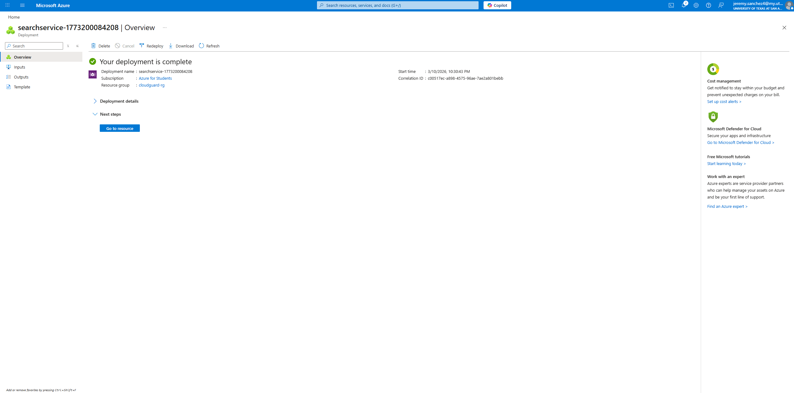
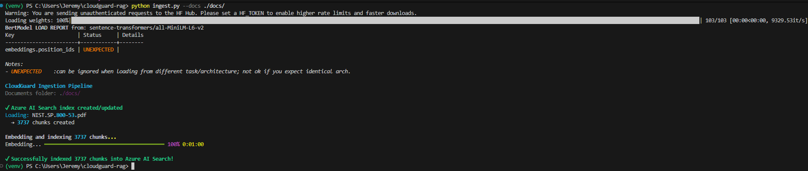
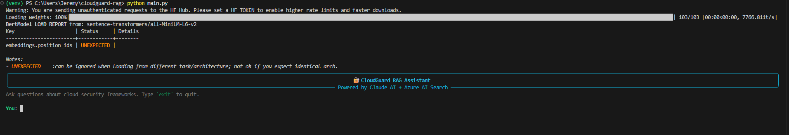
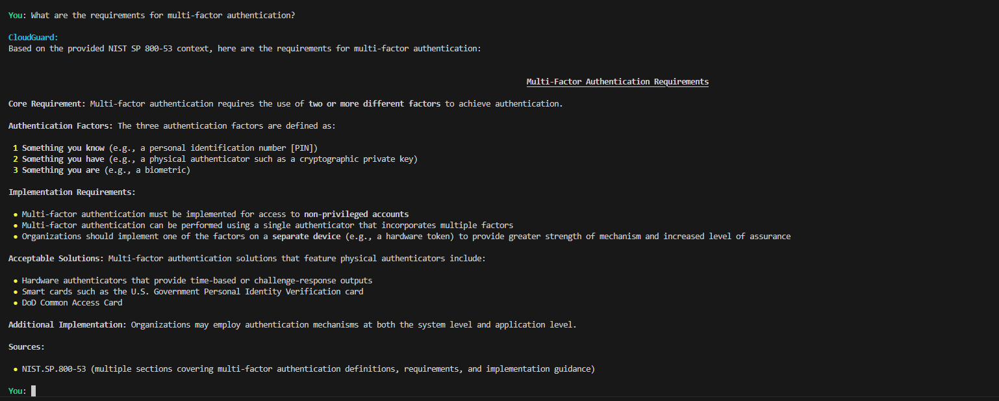
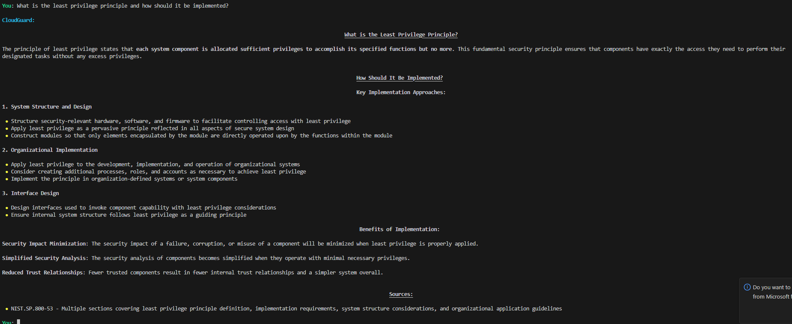

# 🔐 CloudGuard RAG Assistant

> An AI‑powered system that uses RAG to search and answer questions about cloud security frameworks using Claude AI and Azure AI Search.
> 


---

## 📌 Overview

CloudGuard is a command-line RAG assistant that reads cloud security framework documents like the **Azure Security Benchmark**, **CIS Critical Security Controls**, and **NIST SP 800-53**, and answers questions using information from those documents.

Instead of just giving generic security advice, the program first finds the most relevant sections from the documents and then uses Claude to generate an answer based on that information. This helps make the responses more accurate and tied to the actual frameworks.

> 💡 **Architecture note:** This project uses Claude as the language model and local sentence-transformer models to create embeddings. The embeddings are stored in Azure AI Search, which acts as the vector database. The setup was designed so it can work with different providers. If needed, the system could also be switched to Azure OpenAI Service later, which would make it easier to run in an Azure-focused production environment.

**Example queries:**
- *"What controls should I implement for privileged identity management in Azure?"*
- *"How does NIST 800-53 address audit logging requirements?"*
- *"What does the Azure Security Benchmark say about network segmentation?"*

---

## 🏗️ Architecture

```
┌─────────────────────────────────────────────────────┐
│                   User CLI Query                    │
└──────────────────────────┬──────────────────────────┘
                           │
                           ▼
┌─────────────────────────────────────────────────────┐
│         sentence-transformers (local embeddings)    │
│              Embed the user's question              │
└──────────────────────────┬──────────────────────────┘
                           │
                           ▼
┌─────────────────────────────────────────────────────┐
│                   Azure AI Search                   │
│        Vector search over indexed doc chunks        │
└──────────────────────────┬──────────────────────────┘
                           │
                  Top-K relevant chunks
                           │
                           ▼
┌─────────────────────────────────────────────────────┐
│         Anthropic Claude (claude-sonnet-4-6)        │
│   Generate an answer using the retrieved context    │
└──────────────────────────┬──────────────────────────┘
                           │
                           ▼
┌─────────────────────────────────────────────────────┐
│          Rich CLI Output with source citations      │
└─────────────────────────────────────────────────────┘
```

---

## 🚀 Features

- **Document ingestion pipeline** — Automatically splits and indexes PDF or text security framework documents
- **Vector search** — Uses Azure AI Search to find the most relevant sections using semantic similarity
- **Grounded answers** — Claude generates answers based only on the retrieved content and includes source citations
- **Multi-framework support** — Allows multiple security frameworks to be added and searched at the same time
- **Rich CLI** — Simple command-line output with color formatting and source references for each answer

---

## 📋 Prerequisites

- Python 3.10+
- Anthropic API key — [get one here](https://console.anthropic.com/)
- Azure subscription with:
  - Azure AI Search resource (Free tier good enough)
- Git

---

## ⚙️ Setup

### 1. Clone the repository

```bash
git clone https://github.com/Jeremy0219/cloudguard-rag.git
cd cloudguard-rag
```

### 2. Create a virtual environment

```bash
python -m venv venv
source venv/bin/activate        # Linux/macOS
venv\Scripts\activate           # Windows
```

### 3. Install dependencies

```bash
pip install -r requirements.txt
```

### 4. Configure environment variables

Copy the example env file and fill in your credentials:

```bash
cp .env.example .env
```

```env
# Anthropic
ANTHROPIC_API_KEY=your_key_here

# Azure AI Search
AZURE_SEARCH_ENDPOINT=https://YOUR_SEARCH.search.windows.net
AZURE_SEARCH_API_KEY=your_key_here
AZURE_SEARCH_INDEX_NAME=cloudguard-index
```

### 5. Add documents

Place PDF security framework documents in the `docs/` folder. Recommended:
- [NIST SP 800-53 Rev 5](https://csrc.nist.gov/pubs/sp/800/53/r5/upd1/final)
- [Azure Security Benchmark](https://learn.microsoft.com/en-us/azure/security/benchmarks/overview)
- [CIS Controls v8](https://www.cisecurity.org/controls/v8)

### 6. Ingest documents

```bash
python ingest.py --docs ./docs/
```

### 7. Run the assistant

```bash
python main.py
```

---

## 📁 Project Structure

```
cloudguard-rag/
├── docs/                   # Security framework documents (PDF)
├── screenshots/            # Demo screenshots
├── src/
│   ├── __init__.py
│   ├── ingestor.py         # Handles splitting documents, creating embeddings, and indexing
│   ├── retriever.py        # Retrieves relevant document chunks using Azure AI Search
│   └── generator.py        # Uses Claude to generate answers from the retrieved context
├── .env.example            # Example environment variable configuration
├── .gitignore
├── ingest.py               # Script used to ingest and index documents
├── main.py                 # Main script for running queries
├── requirements.txt
└── README.md
```

---

## 🔧 Tech Stack

| Component | Technology |
|---|---|
| Language | Python 3.10+ |
| LLM | Anthropic Claude (claude-sonnet-4-6) |
| Embeddings | Sentence-transformers (local) |
| Vector Store | Azure AI Search |
| PDF Parsing | pypdf |
| CLI UI | rich |
| Config | python-dotenv |

---

## 📸 Demo

### Azure AI Search — Deployed


### Ingestion Pipeline — 3,737 NIST 800-53 chunks indexed into Azure AI Search


### Demo - Running CloudGuard - First Query


### Demo — Multi-Factor Authentication Requirements


### Demo — Least Privilege Principle



---

## 🗺️ Roadmap

- [x] Core RAG pipeline (ingest + retrieve + generate)
- [x] Multi-document support
- [x] Source citation in responses
- [ ] Web UI with Streamlit
- [ ] Azure deployment (Container App)

---

## 📄 License

MIT License: see [LICENSE](LICENSE) for details.

---

## 👤 Author

**Jeremy Sanchez** — CS Student @ UTSA | Cybersecurity Concentration | CompTIA Security+ | AZ-900  
Internship: IT @ Caterpillar Inc.  
[LinkedIn](https://linkedin.com/in/YOUR_PROFILE) · [GitHub](https://github.com/Jeremy0219)
